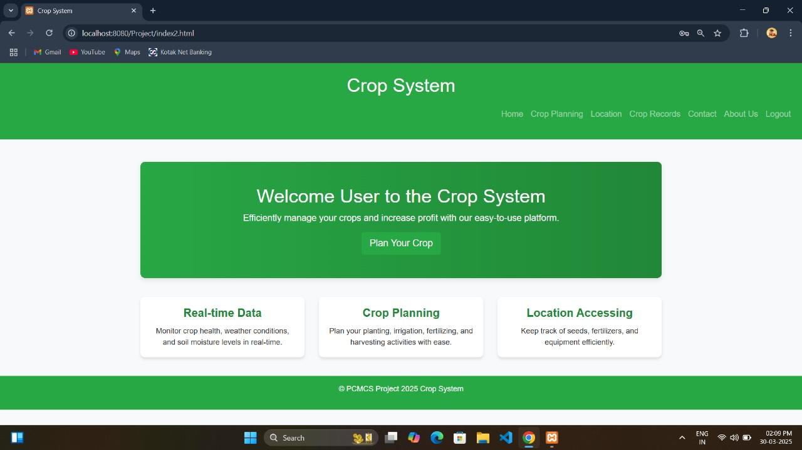
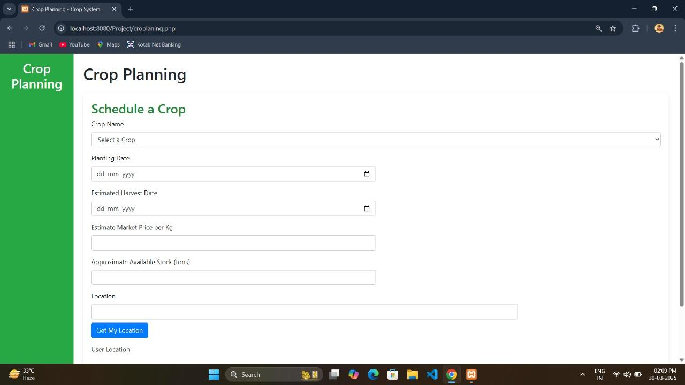
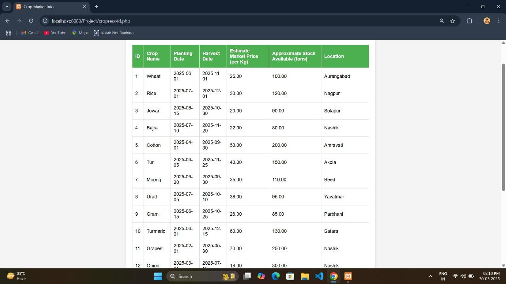

<div align="center">

# 🌾 Crop Planning & Management System

### Smart Agriculture Management Platform built using PHP & MySQL

<p align="center">

<a href="https://cropmanagement.fwh.is/Project/" target="_blank">

</a>

<a href="https://github.com/kulkarnicodes-dev/crop-planning-management-system" target="_blank">

</a>

</p>

A web-based platform developed to help farmers and agricultural stakeholders manage crop planning, crop records, and agricultural information digitally.

---


</div>

---

# 📖 About The Project

The **Crop Planning & Management System** is a web-based application designed to simplify crop planning and agricultural record management.

Instead of maintaining manual records, farmers and agricultural organizations can digitally manage crop information, maintain records, and access agricultural resources through a responsive web interface.

This project demonstrates full-stack web development using **PHP, MySQL, HTML, CSS, JavaScript, and Bootstrap**.

---

# ✨ Features

- 🌱 Crop Planning Management
- 📋 Crop Record Management
- 👨‍🌾 Farmer-Friendly Interface
- 📞 Contact Form
- 🔐 User Registration & Login
- 📱 Fully Responsive Design
- 🗄️ MySQL Database Integration
- ⚡ Fast & Lightweight

---

# 💻 Tech Stack

| Category | Technologies |
|----------|--------------|
| Frontend | HTML5, CSS3, JavaScript, Bootstrap |
| Backend | PHP |
| Database | MySQL |
| Local Server | XAMPP |
| Hosting | InfinityFree |

---

# 📊 Project Statistics

| Feature | Status |
|---------|--------|
| Login System | ✅ |
| Registration | ✅ |
| Database | ✅ |
| Responsive Design | ✅ |
| Live Website | ✅ |
| CRUD Operations | ✅ |

---

# 📸 Screenshot Gallery

## 🏠 Home Page

<p align="center">

</p>

---

## 🌾 Crop Planning

<p align="center">

</p>

---

## 📋 Crop Records

<p align="center">

</p>

---

# 📂 Project Structure

```text
crop-planning-management-system/
│
├── img/
├── Home.png
├── Plan.png
├── Record.png
├── about.html
├── about.css
├── config.php
├── contact.php
├── login.php
├── signup.php
├── croplaning.php
├── croprecord.php
├── crop_system.sql
├── index.html
├── README.md
└── assets/
```

---

# ⚙️ Installation

### Clone Repository

```bash
git clone https://github.com/kulkarnicodes-dev/crop-planning-management-system.git
```

### Open Project

Move the project into

```text
xampp/htdocs/
```

### Import Database

Import

```text
crop_system.sql
```

using **phpMyAdmin**.

### Configure Database

Update

```php
config.php
```

with your MySQL credentials.

### Start Server

- Apache
- MySQL

using XAMPP.

### Open Browser

```text
http://localhost/crop-planning-management-system
```

---

# 🌐 Live Demo

### 🚀 Website

**https://cropmanagement.fwh.is/Project/**

---

# 🚀 Future Improvements

- 🤖 AI Crop Recommendation
- 🌦️ Weather API Integration
- 📍 GPS Farm Location
- 📈 Crop Yield Prediction
- 🌐 Multi-language Support
- 📱 Mobile App Version
- ☁️ Cloud Deployment
- 🔔 SMS & Email Notifications

---

# 📄 License

This project is licensed under the **MIT License**.

Feel free to use this project for educational purposes.

---

# 👨‍💻 Author

## **Yash Kulkarni**

Python & Django Developer

### Connect With Me

<a href="https://www.linkedin.com/in/yash-kulkarni-3203433a0/">

</a>

<a href="https://github.com/kulkarnicodes-dev">

</a>

---

<div align="center">

### ⭐ If you like this project, don't forget to give it a Star ⭐

Made with ❤️ by **Yash Kulkarni**

</div>
